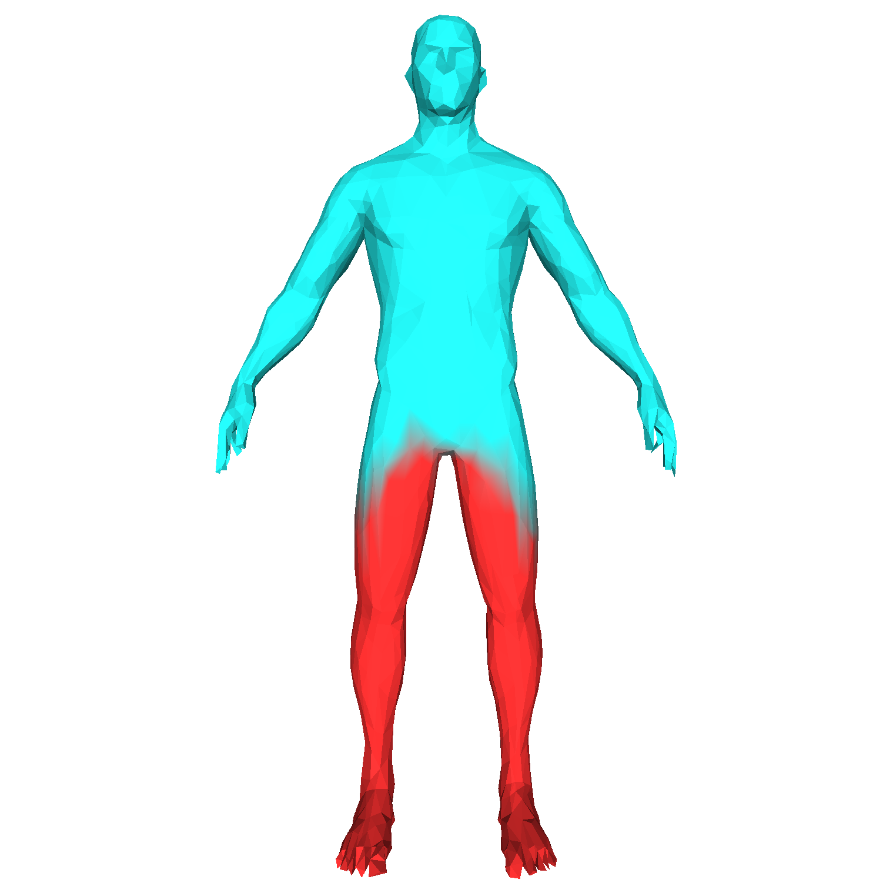

# Mesh Decomposition

Implementation of the binary case of [*Hierarchical Mesh Decomposition using Fuzzy Clustering and Cuts*](https://dl.acm.org/doi/10.1145/1201775.882369). [also a course project of "Computer Graphics (计算机图形学)" of CS, Tsinghua University]

## Dependencies

```shell
pip install numpy scipy trimesh
pip install pyglet  # install it if you need to view the mesh
```

## Usage

```
usage: main.py [-h] -i INPUT -o OUTPUT [-m {binary,k-way}] [--show] [--eta ETA] [--delta DELTA] [--epsilon EPSILON]

optional arguments:
  -h, --help            show this help message and exit
  -i INPUT, --input INPUT
                        input mesh file
  -o OUTPUT, --output OUTPUT
                        output decomposed mesh file
  -m {binary,k-way}, --method {binary,k-way}
                        decomposition method
  --show                whether to show the colored decomposed mesh (requires `pyglet`)
  --eta ETA             weight for convex angular distance
  --delta DELTA         weight for geodesic distance
  --epsilon EPSILON     half interval for fuzzy region
```

## Results

<table>
    <tr>
        <td></td>
        <td></td>  
    </tr>
</table>
